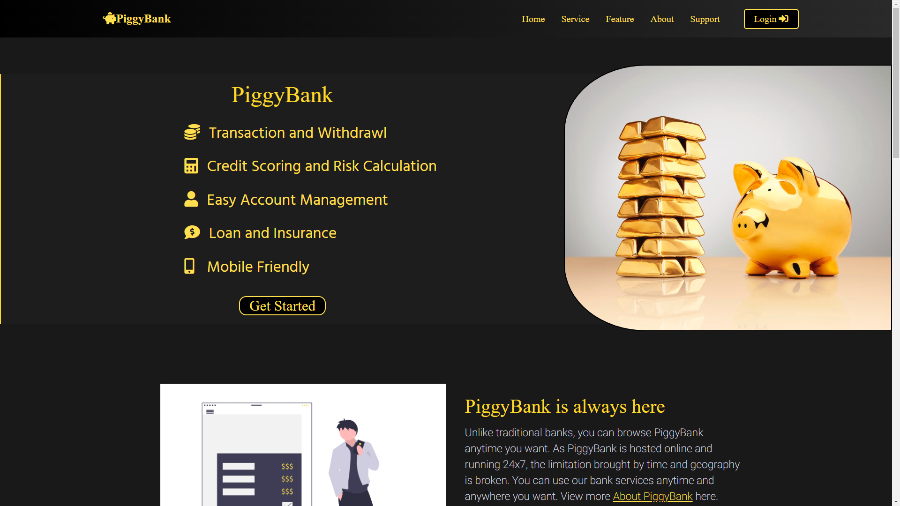

# PiggyBank

### PiggyBank is a fully responsive web application, which operates and provides various bank functions by REST API and Database CRUD Operations.

###### Notice: This project is still on development status (5/3/2022)

### `Technologies: ReactJS, CSS, NodeJS, ExpressJS, MySQL, Axios, Bcrypt`

---

### Before running this project in local, you should:
#### - Establish a MySQL database at port 3306
#### - Install node.js
#### - Create your own environment variable (SECRETs)
#### - All environment variable: 
`DBPASSWORD, DBUSER, SESSIONSECRET, JWTTOKEN, SALT, SMTP_HOST, SMTP_PORT, SMTP_USER, SMTP_PASSWORD`

---

### In the project directory, you can run:
### FrontEnd (React App)
#### `npm start`

### BackEnd (NodeJs)
#### `node src/api/AccountApi`
#### `node src/api/EmailApi`
#### `node src/api/ProfileApi`

---

### Runs the app in the broswer:
Open [http://localhost:3000](http://localhost:3000)

The page will reload when you make changes.\
You may also see any lint errors in the console.

---

### Preview:

---

### Learn More:

You can learn more in the [Create React App documentation](https://facebook.github.io/create-react-app/docs/getting-started).

To learn React, check out the [React documentation](https://reactjs.org/).

To learn NodeJS, check out the [NodeJS documentation](https://nodejs.org/en/docs/).

To learn MySQL, check out the [MySQL documentation](https://dev.mysql.com/doc/).
